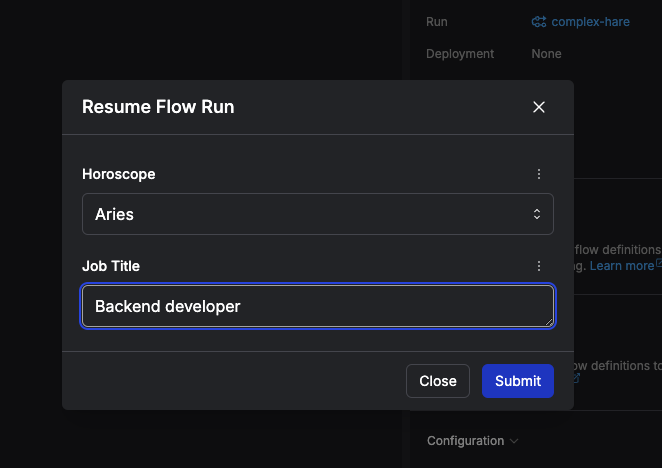

# dev_zodiac_app
A project developed during the Prefect Associate Certification Course to explore Prefect’s tasks, flows, subflows, pause flow runs, and user inputs. This satirical horoscope generator pauses to collect a star sign and job title, scrapes a daily horoscope, and rewrites it humorously for developers using the OpenAI API.

Example - OG_horoscope
Fetching monthly horoscope
November 2024 - On November 1, the Scorpio new moon awakens your realm of values and resources. This is an excellent time to rework your approach to generating wealth, creating ample security on both financial and personal levels. Mercury bolts into Sagittarius on the second, igniting a fire in your communication sector. Allow your curiosity to lead the way, exploring new ideas with unbridled optimism. As you communicate boldly, avoid being too blunt or overlooking important details.November Premium HoroscopeWe are not going to lie, the month ahead comes with its fair share of intense aspects! November is a month that will keep you on your toes. Get ready for exciting displays of confidence when Mars strides into Leo on November 3, lighting up your zone of friendship and hope. This is the Universe’s way of amplifying your dreams, pushing you to chase your goals with courage.Venus glides into Capricorn on the eleventh and settles into your chamber of intuition. Appreciate the love that grounds you. As you nurture your roots, an enduring connection to the people and places that hold your heart will strengthen.Energy intensifies during the Taurus full moon on November 15 that illuminates your realm of intimacy. You’re being tasked with rebirth in private corners of your life, so give yourself extra love and grace.Pluto enters Aquarius on the nineteenth, where it will remain until 2043. Pluto drills down into your domain of creativity and romance, promising to reshape your passion, pleasure, and how you manifest love and artistry in the new age.The sun enters Sagittarius on November 21, followed by Mercury retrograde in that same sign four days later, bringing attention to important connections and conversations. Open-mindedness and flexibility will be well received.Good luck this month, Libra!Standout days: 9, 17, 25Challenging days: 6, 16,26

Example - Dev horoscope
Your stars foresee a month filled with intense coding sessions and endless debugging marathons, dear data application engineer! As the Scorpio new moon awakens your realm of data values and resources, it's time to rework your approach to generating data wealth and creating ample security in your code.

When Mercury bolts into Sagittarius, igniting a fire in your communication sector, let your curiosity guide you through the maze of API documentation and explore new data processing ideas with unbridled optimism. Just remember to communicate boldly without being too blunt or overlooking those pesky syntax errors.

Get ready for exciting displays of confidence when Mars strides into Leo, lighting up your zone of data pipelines and hope. Embrace the Universe's push to chase your coding goals with courage, even if it means diving into that messy legacy codebase.

As Venus glides into Capricorn and settles into your chamber of data intuition, appreciate the love that grounds you in your data wrangling endeavors. Nurture your roots in data engineering, strengthening your connection to the people and places that hold your heart, like that cozy corner of the office with the best Wi-Fi signal.

During the Taurus full moon that illuminates your realm of data intimacy, give yourself some extra love and grace as you tackle those tricky data integration challenges in private corners of your code. And when Pluto enters Aquarius to drill down into your domain of data creativity and romance, embrace the opportunity to reshape your passion for elegant data structures and manifest love for clean, well-documented code in this new age of data engineering.

Remember, as the sun enters Sagittarius and Mercury retrograde follows suit, pay attention to important connections and conversations in your data application engineering world. Stay open-minded and flexible, especially when your colleague suggests using a different data visualization tool or when your manager decides to pivot the entire project scope.

Good luck this month, data application engineer! And remember, standout days will be when your code compiles on the first try, and challenging days will be when you accidentally push sensitive data to the wrong repository.

### Original horoscope (Example)
November 2024 - The Scorpio new moon in your realm of transformation on November 1 initiates a deep dive into themes of change, intimacy, and resources. It’s a powerful cosmic moment to set intentions around emotional and financial empowerment. Exploring the depths of your relationships and investments will bring helpful insights.Mercury’s entry into Sagittarius on the second activates your adventure sector, shifting your focus toward learning, exploration, and movement. Mercury inspires your quest for knowledge and meaning, urging you to discover new paths and embrace new, more expansive perspectives.November Premium HoroscopeWe are not going to lie, the month ahead comes with its fair share of intense aspects! November is a month that will keep you on your toes. On November 3, Mars blasts into Leo, igniting your realm of creativity. Your increased drive for self-expression, fun, and pleasure encourages boldness in love and artistry. Passion is heightened.Venus enters practical Capricorn on the eleventh, bringing a productive tone to your career zone. You’re encouraged to approach your goals with integrity and strengthen professional relationships based on mutual respect and shared ambitions.The Taurus full moon on November 15 illuminates your financial zone, highlighting security and self-esteem. As you reevaluate what is most important to you, consider ways to release what no longer supports your sense of stability and confidence.Pluto enters Aquarius on the nineteenth, where it will remain until 2043. This cycle activates significant changes in your friendship circles and contributions to society, emphasizing new community involvement.The sun’s entry into outgoing Sagittarius on November 21 amplifies your need for growth, action, and knowledge, while Mercury retrograde in Sagittarius, starting four days later, advises a period of reflection. How can you honor inward growth alongside outward expansion?Good luck this month, Aries!Standout days: 6, 23, 30Challenging days: 14, 16, 2

### Dev horoscope (Example)
Inputs via the Prefect Cloud UI: Aries, Backend Developer

Your stars foresee a month filled with intense debugging sessions and navigating through endless Git branches. The Scorpio new moon on November 1 signals a deep dive into code transformations, where you'll be challenged to refactor and optimize your backend systems. Embrace the themes of change, intimacy (with your code), and available resources (like that elusive API documentation).

Mercury's entry into Sagittarius on the second will activate your adventure sector, pushing you to explore new libraries, frameworks, and technologies. Get ready to embark on a quest for knowledge and meaning, as you debug through mysterious backend errors and unravel complex data structures.

On November 3, Mars will blast into Leo, sparking your creativity in problem-solving and algorithm design. Embrace the increased drive for self-expression in your code and find pleasure in optimizing backend performance. Your passion for backend development is heightened, so don't be afraid to boldly refactor and improve your codebase.

As Venus enters practical Capricorn on the eleventh, focus on approaching your backend development goals with integrity and strengthening professional relationships with fellow developers and stakeholders. Build solid backend systems based on mutual respect and shared ambitions, ensuring a productive and harmonious workflow.

The Taurus full moon on November 15 will illuminate your financial zone, reminding you to prioritize security and stability in your backend projects. Reevaluate outdated code practices and release what no longer supports the efficiency and reliability of your backend systems.

With Pluto entering Aquarius on the nineteenth, expect significant changes in your technical community and contributions to the programming world. Embrace new backend development tools, collaborate with diverse coding groups, and enhance your backend skills to adapt to the evolving tech landscape.

As the sun enters outgoing Sagittarius on November 21, embrace the need for growth, action, and knowledge in your backend development journey. However, be prepared for Mercury retrograde in Sagittarius shortly after, advising a period of reflection on your coding practices and backend architecture. Balance inward growth with outward expansion in your backend projects for a successful month ahead, backend dev! Good luck navigating through the code jungle.

Standout days: When your code compiles on the first try, when the pull request is approved without any comments, when the server stays up without crashing
Challenging days: When the deployment fails on a Friday afternoon, when you accidentally push sensitive data to the repository

